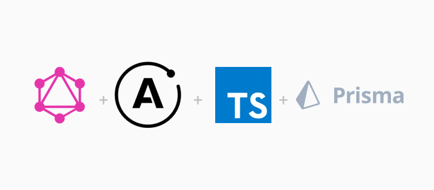

<div>
  
</div>
<h1 style="text-align: center;">Super Power GraphQL Backend</h1>
<p style="text-align: center;">This is a Super Power GraphQL Backend with Prisma and Typescript</p>

[](https://issuehunt.io/r/ganobrega/super-power-graphql-backend/invite/WVbpk70yVv)

## 🤷🏽 Why?

This is a production ready for a modern architecture with **Typescript**, **GraphQL** and **Prisma**.

Leave _REST API_ behind forever.

## 🚀 Features

- 🛰 Express and Apollo Server;
- 💅 Typescript;
- 🐳 Docker with:
  - 🐘 Postgres;
- 🔼 Prisma 2
  - **Real World Schema** example;
  - Auto-generated resolvers
  - Easy to include custom resolvers
- ✅ No **REST** included

## ⚡️ Getting started

1. Up the docker-compose

   ```
   $ docker-compose up
   ```

2. Generate the prisma

   ```
   $ yarn prisma generate
   ```

3. Push the model to database

   ```
   $ yarn prisma db push --preview-feature
   ```

4. Start the server

   ```
   $ yarn dev
   ```

5. 🌐 Open the `/playground` on browser
